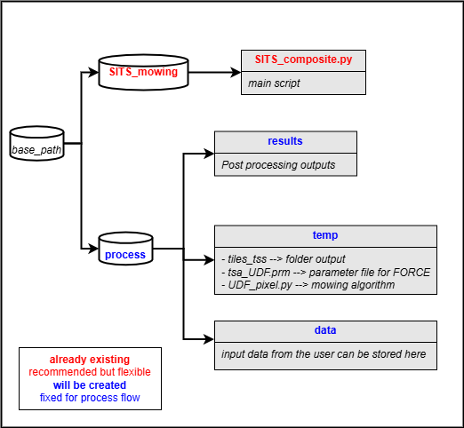

# SITS mowing stack

With SITS mowing stack you can obtain an estimate mowing events on different land uses based on spectral indices (NDVI, EVI) 
derived from Sentinel-2 and Landsat data with 10m spatial resolution. The code uses Satellite Image Time Series (SITS) composite based on [FORCE Time Series framework](https://force-eo.readthedocs.io/en/latest/index.html).

## 1. Installing

The basic parameters installations are implemented for Ubuntu 22.04 "jammy":

```
conda create --name SITSmow python==3.9
conda activate SITSmow
cd /path/to/repository/SITS_mowing
pip install -r requirements.txt
sudo apt-get install xterm
```
Notes: The code is build upon the [mowing UDF algorithm](https://github.com/davidfrantz/force-udf/tree/main/python/ts/mowingDetection).

## 2. Output

The algorithm is pixel based. The output is a raster stack with 17 bands that contain:

- **B1:** Sum of mowing events
- **B2:** Maximum data gap in original time series
- **B3:** absolute clear sky observations (CSO)
- **B4:** CSO/potential observations (*100)
- **B5:** DOY of detected mowing events
- **B12:** Mean VI value of the defined grassland season
- **B13:** Median VI value of the defined grassland season
- **B14:** VI standard deviation of the defined grassland season
- **B15:** Sum of differences between interpolated and original values (*100)
- **B16:** Sum of differences between interpolated and original values * data availability (*100)
- **B17:** Processing error [0,1]


### 3. Basics

- The **SITS_mowing_script.py** has default tested parameters that can be modified considering user needs.
- The main script will create two more files, the parameter file (tsa_UDF.prm) and the User Defined Function (UDF_pixel.py)
file. The first is related to the needed information to run FORCE datacube; the second is related to the mowing detection algorithm.



**Additional information:**

The following parameters might be changed in the UDF_pixel.py file (search for the function: detectMow_S2_new):
- GLstart and GLend (defines the approximate length of grassland season in which you expect the main mowing activity; make sure too include a buffer)
- PSstart and PSend (defines the approximate length of the main vegetation season; i.e., time of the year in which you expect at least one peak)
- GFstd and posEval (sensitivity of thresholds; i.e., width of gaussian function and number of positive evaluations)

- For more information about the parameter and UDF files, please check the above links.

## Authors

* [Sebastian Valencia](https://github.com/Azarozo19)

## License

This project is licensed under the GNU General Public Licence, Version 3 (GPLv3) - see the LICENSE.md file for details

